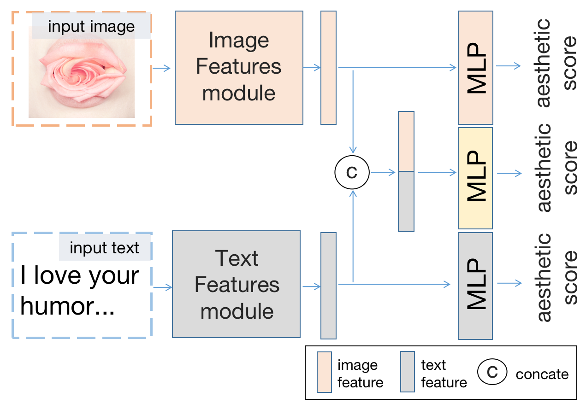
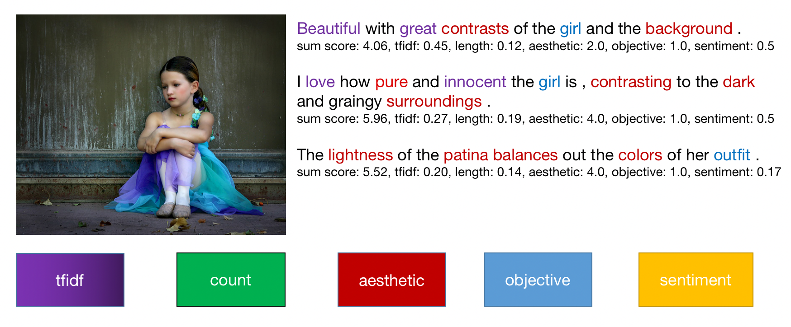
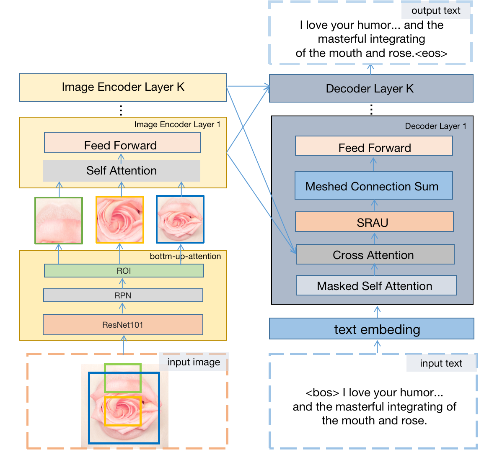
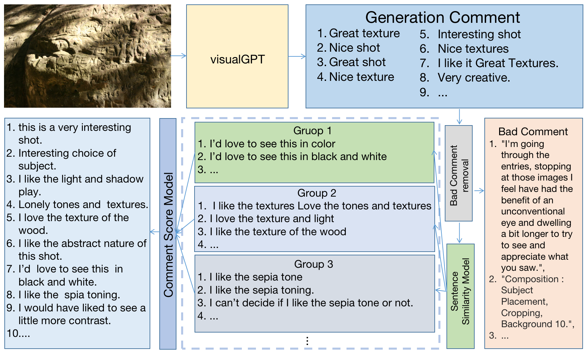
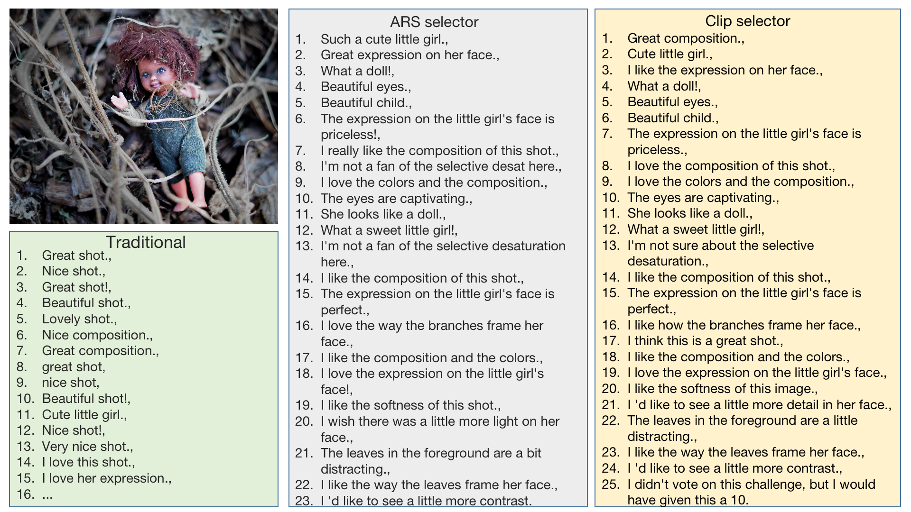
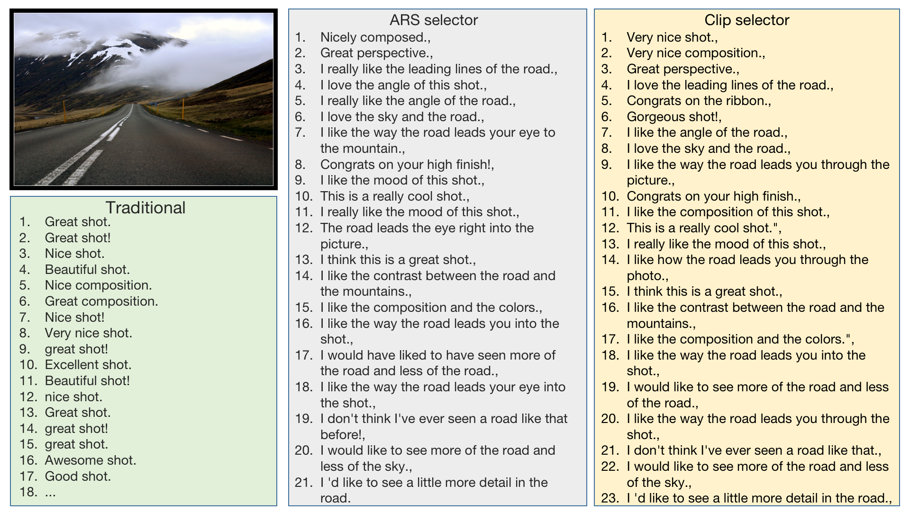
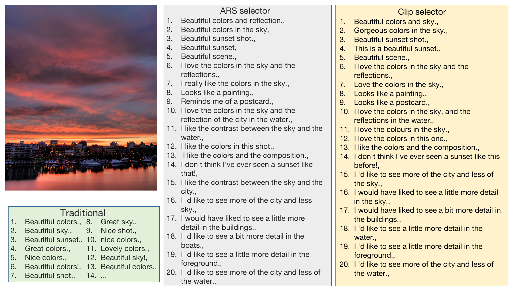

# Aesthetically Relevant Image Captioning

Zhipeng Zhong, Fei Zhou and Guoping Qiu

This repository is the official PyTorch implementation of *Aesthetically Relevant Image Captioning*([arxiv](https://arxiv.org/abs/2211.15378)). This paper has been accepted by AAAI 2023.


## Contents

0. [Introduction](#Introduction)
1. [Installation](#Installation)
2. [Dataset](#Dataset)
3. [Train](#Train)
4. [Test](#Test)
5. [Results](#Results)
6. [Citation](#Citation)
7. [Acknowledgment](#Acknowledgment)
8. [License](#License)

<h2 id="Introduction"> Introduction </h2>
In this paper, we study image AQA and IAC together and present a new IAC method termed Aesthetically Relevant Image Captioning (ARIC). Based on the observation that most textual comments of an image are about objects and their interactions rather than aspects of aes- thetics, we first introduce the concept of Aesthetic Relevance Score (ARS) of a sentence and have developed a model to automatically label a sentence with its ARS. We then use the ARS to design the ARIC model which includes an ARS weighted IAC loss function and an ARS based diverse aes- thetic caption selector (DACS). We present extensive exper- imental results to show the soundness of the ARS concept and the effectiveness of the ARIC model by demonstrating that texts with higher ARS’s can predict the aesthetic ratings more accurately and that the new ARIC model can generate more accurate, aesthetically more relevant and more diverse image captions. Furthermore, a large new research database containing 510K images with over 5 million comments and 350K aesthetic scores




<h2 id="Dataset"> Dataset </h2>

### 1. Dataset preparation

You need to download the DPC2022 dataset.

   For DPC2022 dataset, you can download it in [Baidu Netdisk](https://pan.baidu.com/s/1TT1EKNV3ivYXUDoX5hDVag) (access code: lrpn)

### 2. Dataset format



we manually selected 1022 most frequently appeared image aesthetics related words such as shot, color, composition, light, focus, background, subject, detail, contrast, etc. we manually selected 2146 words related to objects such as eye, sky, face, ribbon, water, tree, flower, expression, hand, bird, glass, dog, hair, cat, smile, sun, window, car, etc. All of them can be avaiable at directory aesthetic_and_object_word in DPC2022.

There is an illustration for a data annotation example 245925.json 
```
   "ID": "245925",
   ...
   "avg_all_users_score": 5.3108, (aesthetic score)
   ...
   "raw_comments": [...],  (raw comments without any preprocessing)
   "clean_comments": [...] ( divide acomment to sentences and remove emoji and other strange spellings, symbols and punctuation marks)
   "score_comments":[...] (labeled sentences)
   "score_comments":[
       "comment": {
                "comment": sentence text
                "tfidf_cscore": normalize tfidf score
                "length": length of sentence
                "words": [...] the word and part of speech after  tokenize sentence.
            },
            "sum_score": ARS score
            "norm_sum_score": normlize ARS score
            "tfidf": 
            "length": score about count of words in the sentence
            "aesthetic": score about count of aesthetic words in the sentence
            "objective": score about count of object words in the sentence
            "sentiment": sentiment score
            "sentiments": {
                "neg_score": 
                "neu_score": 
                "pos_score": 
            },
            "clip_score": clip score
            "norm_clip_score": normlize clip score
        },
   ]


```

<h2 id="Installation"> Installation </h2>

there are some bug I don't know using data distribution if torch version 1.7.1

* Python 3.8.0
* torch 1.7.1+cu110
* NVIDIA GPU + CUDA


1. Clone repo

    ```git clone https://github.com/PengZai/ARIC.git```

2. Install dependent packages

   ```
   cd ARIC
   conda create -n ARIC python=3.8.0
   conda activate ARIC
   pip install -r requirements.txt 
   pip install torch==1.7.1+cu110 torchvision==0.8.2+cu110 torchaudio==0.7.2 -f https://download.pytorch.org/whl/torch_stable.html
   pip install git+https://github.com/openai/CLIP.git

   ```


<h2 id="Train"> Train </h2>

### 1. Component prepare

   you are required to download pretrain [models](https://pan.baidu.com/s/1CAj0lLLkBscz6x91-Bf_4A) and [metrices](https://pan.baidu.com/s/1CAj0lLLkBscz6x91-Bf_4A) and move them to workspaceFolder.(access code: spd5)
   
### 2. Modify Config.py

modify these paths to correct paths. 
```
    --huggingface_model_root (huggingface model bert, roberta, vit)
    --image_root 
    --image_bottom_up_attention_feature_root
    --data_root (directory clean_and_all_score)
    --train_root (directory containing train.csv)
    --comments_root (directory containing train_split_by_val_scored_comment_id_pair.csv)
    --test_and_val_root (directory containing test.csv and val.csv)
```

### 3. train visualgpt and generate caption using Diverse Aesthetic Caption Selector (DACS) 
   
```
   bash dist_train.sh
```

### 4. Visualgpt

### 5. DACS



<h2 id="Test"> Test </h2>

### 1.Image AQA based on Generated Captions

```
   bash dist_generation_eval.sh
```


<h2 id="Results"> Results </h2>

There are some Diverse Aesthetic Caption Selector (DACS) results






<h2 id="Citation"> Citation </h2>

```
@article{zhong2022aesthetically,
  title={Aesthetically Relevant Image Captioning},
  author={Zhong, Zhipeng and Zhou, Fei and Qiu, Guoping},
  journal={arXiv preprint arXiv:2211.15378},
  year={2022}
}
```

<h2 id="Acknowledgment"> Acknowledgment </h2>

   Our code is built on [VisualGPT](https://github.com/Vision-CAIR/VisualGPT). We thank the authors for sharing their codes.


<h2 id="License"> License </h2> 

   The code and DPC2022 dataset are released under the Creative Commons Attribution-NonCommercial-ShareAlike 4.0 International
   Public License for NonCommercial use only. Any commercial use should get formal permission first. 
