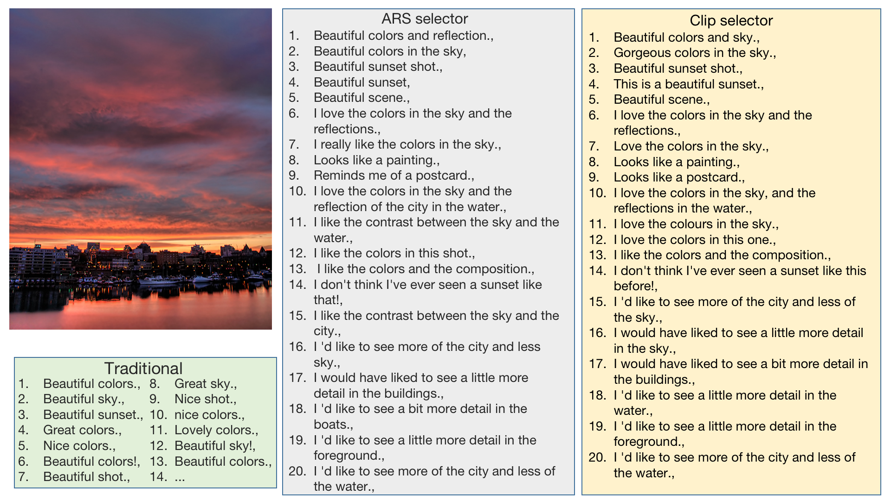

# Aesthetically Relevant Image Captioning

Zhipeng Zhong, Fei Zhou and Guoping Qiu

This repository is the official PyTorch implementation of *Aesthetically Relevant Image Captioning*([arxiv](https://arxiv.org/abs/2211.15378)). This paper has been accepted by AAAI 2023.


## Contents

0. [Introduction](#Introduction)
1. [Installation](#Installation)
2. [Dataset](#Dataset)
3. [Train](#Train)
4. [Test](#Test)
5. [Results](#Results)
6. [Citation](#Citation)
7. [Acknowledgment](#Acknowledgment)
8. [License](#License)

<h2 id="Introduction"> Introduction </h2>


<h2 id="Dataset"> Dataset </h2>

### 1. Dataset preparation

You need to download the DPC2022 dataset.

   For DPC2022 dataset, you can download it in [Baidu Netdisk](https://pan.baidu.com/s/1jHP2o-IhXGwh9zl_RKA0ZQ) (access code: rsqw)

### 2. Dataset format


<h2 id="Installation"> Installation </h2>


* Python 3.8.0
* torch 1.9.1+cu111
* NVIDIA GPU + CUDA

1. Clone repo

    ```git clone https://github.com/PengZai/ARIC.git```

2. Install dependent packages

   ```
   cd VOTES
   conda create -n ARIC python=3.10.0
   conda activate ARIC
   pip install -r requirements.txt 
   ```


<h2 id="Train"> Train </h2>

### 1.DACS training


<h2 id="Test"> Test </h2>

### 1.DACS demo

### 2.ARS demo


<h2 id="Results"> Results </h2>

There are some Diverse Aesthetic Caption Selector (DACS) results





<h2 id="Citation"> Citation </h2>

```
@article{zhong2022aesthetically,
  title={Aesthetically Relevant Image Captioning},
  author={Zhong, Zhipeng and Zhou, Fei and Qiu, Guoping},
  journal={arXiv preprint arXiv:2211.15378},
  year={2022}
}
```

<h2 id="Acknowledgment"> Acknowledgment </h2>

   Our code is built on [VisualGPT](https://github.com/Vision-CAIR/VisualGPT). We thank the authors for sharing their codes.


<h2 id="License"> License </h2> 

   The code and DPC2022 dataset are released under the Creative Commons Attribution-NonCommercial-ShareAlike 4.0 International
   Public License for NonCommercial use only. Any commercial use should get formal permission first. 
